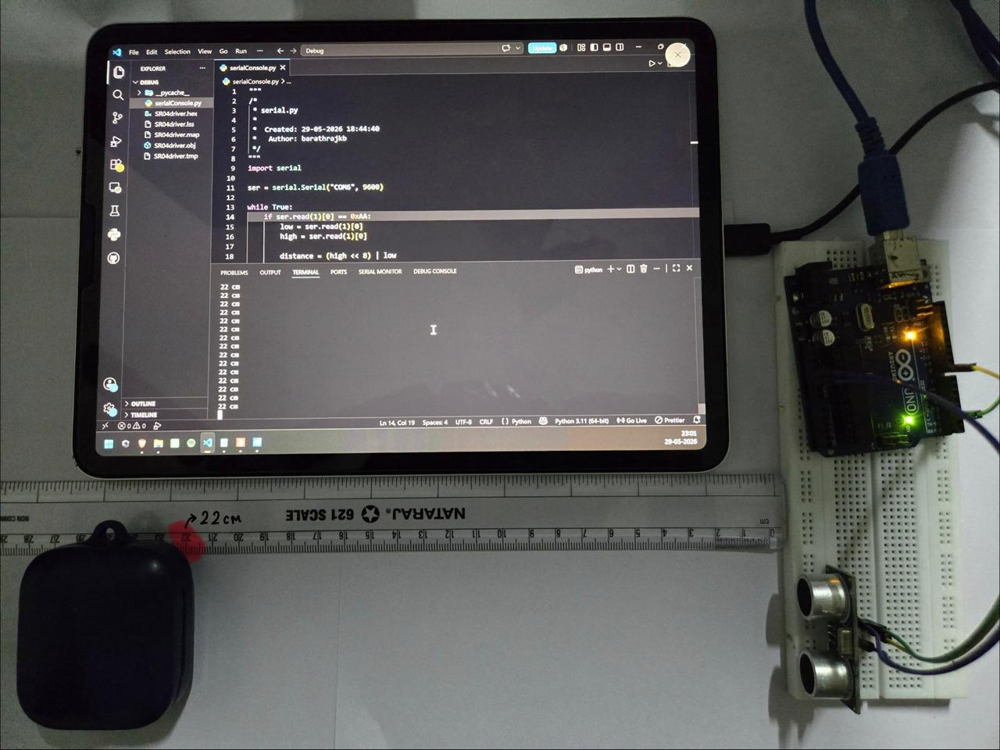
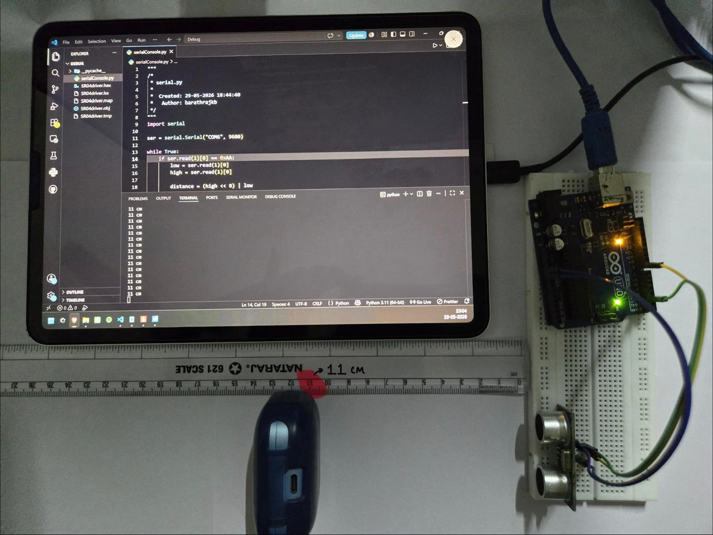
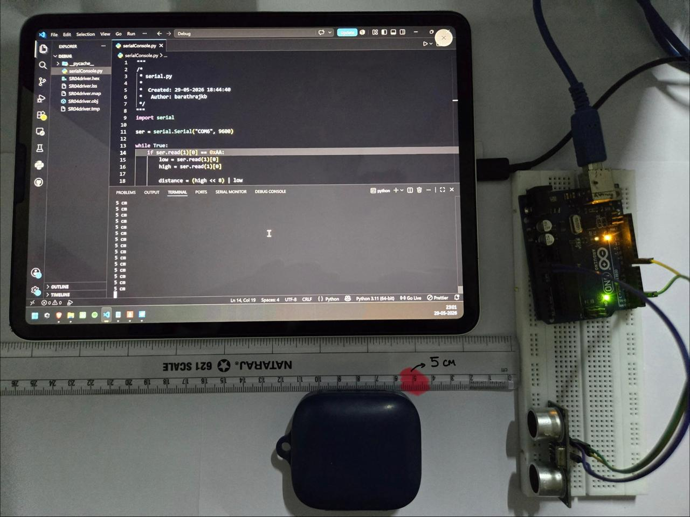

# 📡 AVR Assembly HC-SR04 Ultrasonic Sensor Driver

> A complete HC-SR04 ultrasonic sensor driver developed entirely in AVR Assembly Language using the ATmega328P Timer Input Capture Unit for hardware-assisted pulse width measurement.

---

## 📌 Overview

This project implements a reusable HC-SR04 ultrasonic distance measurement driver for the ATmega328P microcontroller.

Unlike conventional Arduino implementations that rely on software timing functions such as `pulseIn()` or third-party libraries, this driver directly utilizes the ATmega328P's hardware peripherals to perform accurate distance measurements with minimal resource usage.

The firmware captures both rising and falling edges of the HC-SR04 ECHO signal using the Timer1 Input Capture Unit (ICU), computes pulse width using 16-bit arithmetic, converts the result into distance, and transmits measurements to a host PC through a custom UART binary protocol.

No Arduino libraries, no C code, and no framework dependencies are used.

---

## 🎯 Project Objectives

* Develop a reusable ultrasonic sensor driver in AVR Assembly
* Explore Timer Input Capture operation
* Implement 16-bit arithmetic without compiler support
* Build a modular multi-file firmware architecture
* Design a lightweight UART communication protocol
* Create an end-to-end embedded measurement system

---

## 🧠 System Architecture

```text
              HC-SR04
                 │
                 ▼
      Timer1 Input Capture Unit
                 │
                 ▼
       Pulse Width Measurement
                 │
                 ▼
        Distance Calculation
                 │
                 ▼
            UART Driver
                 │
                 ▼
          Binary Protocol
                 │
                 ▼
            USB Serial
                 │
                 ▼
        Python Host Viewer
```

---

## 🔌 Hardware Interface

### Microcontroller

* ATmega328P
* 16 MHz System Clock
* Arduino Uno

### Sensor

* HC-SR04 Ultrasonic Sensor

### Connections

| HC-SR04 | ATmega328P | Arduino Uno |
| ------- | ---------- | ----------- |
| VCC     | 5V         | 5V          |
| GND     | GND        | GND         |
| TRIG    | PD2        | D2          |
| ECHO    | PB0 (ICP1) | D8          |

Additional Interfaces:

| Signal     | ATmega328P | Arduino Uno |
| ---------- | ---------- | ----------- |
| UART TX    | PD1        | D1          |
| Status LED | PB5        | D13         |

---

## 🧩 Firmware Architecture

```text
main.asm
│
├── tim1.asm
│   └── Timer1 Initialization
│
├── hcsr04.asm
│   ├── Trigger Generation
│   ├── Rising Edge Capture
│   ├── Falling Edge Capture
│   ├── Pulse Width Calculation
│   └── Distance Computation
│
├── uart.asm
│   ├── UART Initialization
│   ├── Byte Transmission
│   └── Packet Transmission
│
└── globals.asm
    └── Shared Variables
```

---

## ⚙️ Measurement Flow

```text
Generate Trigger Pulse
         │
         ▼
Capture Rising Edge
         │
         ▼
Store Timestamp
         │
         ▼
Capture Falling Edge
         │
         ▼
Store Timestamp
         │
         ▼
Calculate Pulse Width
         │
         ▼
Convert to Distance
         │
         ▼
Transmit UART Packet
```

---

## 📦 UART Communication Protocol

The firmware transmits distance measurements using a custom binary packet format.

### Packet Structure

| Byte | Description        |
| ---- | ------------------ |
| 0    | Start Byte (0xAA)  |
| 1    | Distance Low Byte  |
| 2    | Distance High Byte |

### Example

```text
AA 7B 00
```

Decoded Distance:

```text
123 cm
```

---

## 🖥️ Host Application

A Python-based monitoring application receives and processes UART packets.

Responsibilities:

* Packet synchronization
* Distance reconstruction
* Real-time measurement display

Example Output:

```text
121 cm
122 cm
123 cm
122 cm
121 cm
```

---
## ✅ Results

The driver was successfully validated on real ATmega328P hardware using an HC-SR04 ultrasonic sensor.

Distance measurements were transmitted over UART using the custom binary protocol and displayed on a host PC through the Python monitoring application.

### Distance = 22 cm




### Distance = 11 cm




### Distance = 5 cm



---

## 📊 Resource Utilization

### Firmware

```text
Flash Usage : 316 Bytes out of available 32768 Bytes
RAM Usage   : 8 Bytes out of available 2048 Bytes
```

Build Summary:
```text
"ATmega328P" memory use summary [bytes]:
		Segment   Begin    End      Code   Data   Used    Size   Use%
		---------------------------------------------------------------
		[.cseg] 0x000000 0x00013c    316      0    316   32768   1.0%
		[.dseg] 0x000100 0x000108      0      8      8    2048   0.4%
		[.eseg] 0x000000 0x000000      0      0      0    1024   0.0%
		Assembly complete, 0 errors. 0 warnings
Build succeeded.
```
### MCU Specifications

```text
ATmega328P
16 MHz Clock
UART @ 9600 Baud
```

The project occupies only a small fraction (1%) of the available ATmega328P resources.

---

## 🎯 Key Design Highlights

* Pure AVR Assembly implementation
* Hardware-assisted pulse measurement using Timer1 Input Capture
* Modular multi-file firmware architecture
* No Arduino framework or external libraries
* Lightweight UART binary protocol
* Host-side monitoring application
* Extremely small memory footprint
* Real hardware validation

---

## 📈 Skills Demonstrated

### Embedded Systems

* Bare-metal firmware development
* Peripheral configuration
* Hardware abstraction

### AVR Architecture

* AVR Assembly programming
* Register-level development
* Memory management

### Timer Systems

* Timer configuration
* Input Capture operation
* Hardware timestamping

### Communication Protocols

* UART implementation
* Binary packet design
* Host-device communication

### Firmware Engineering

* Driver development
* Modular software architecture
* Embedded debugging

---

## 🚧 Future Improvements

* Interrupt-driven measurements
* Measurement timeout handling
* Multi-sensor support
* OLED/LCD integration
* Automated calibration
* Driver packaging as reusable library

---

## 👤 Author

**Barath Raj KB**

B.E. Electronics and Communication Engineering

---

> *"Building drivers teaches you how hardware actually works. Everything else is an abstraction built on top."*
